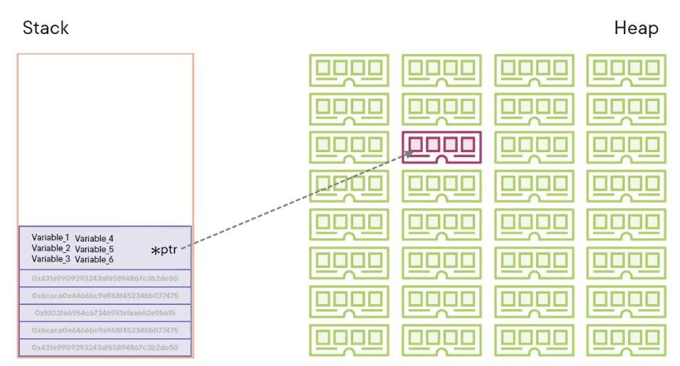

# Rust Fundamentals

Rust is a `Static` and `Strong` language

#### Data types
- Static - We know all of the data types at compile time
- Dynamic - We only know the data types at run time

#### Enforcements
- Strong - Enforces rules on data type assignments
- Weak - Has Few or no enforcement on data type assignments

#### Language
- Compiled, fast
- Interpreted, on the fly - portable

#### Memory
- Stack - pila, last in last out, when stack overflow happens, to many data -> we use the heap
- Heap - has a pointer pointing to the data in memory 



## Notes

- Cannot change the value of a variable - or declare the variable as mutable.
- `Ownership and Burrowing`, Core rust memory management
- `Associated methods`, method associated to a data structure
- `Crates`, modules
- `Macros`, ! built-in functions 

## Rust Toolchain

Toolchain components:

- Rust Compilet
- Cargo (package manager)

[Rustup](https://rustup.rs/), a toolchain management utility

## Bynary command

```
> rustc
```

## Section: Data Types

### Scalar, holds a single value

### Primitives
- Integers
- (u)unsiged 0 - 255
- (i)signed -128 127 
- isize, usize - related to the CPU architecture
- floating points - singed

### Bolean
- True / False

### Characters
- A, B, C (ASCII)

Rush uses 4 Bytes, 4294967296, characters in Unicode-32 table, basically support everything

### Compound, holds multiple values in a single variable

## Array
- Multiples values of a single data types

## Tuple
- Multiples values of different data types

Array and Tuples has A FIXED size

## Strings

We have two alternatives:

### String
- mutable
- u8 data vector
- stored on the heap

### &str (hardcoded string)
- Immutable
- u8 data vector
- stored on the heap/stack or compiled code

## Section: Variables

